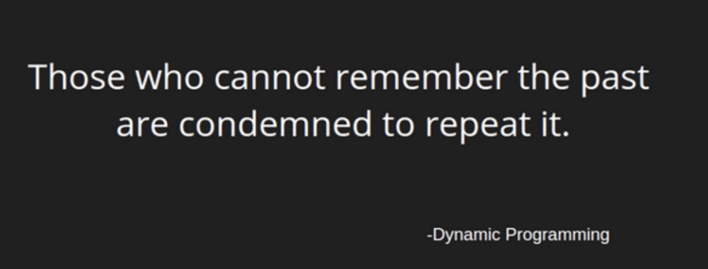

## [Demystifying Dynamic Programming](https://www.freecodecamp.org/news/demystifying-dynamic-programming-3efafb8d4296/)

`memoization` `reword` `thrice` `recurrence` `vet`

## [Dynamic Programming](https://www.geeksforgeeks.org/dynamic-programming/)

>Dynamic Programming is mainly an optimization over plain recursion. Wherever we see a recursive solution that has repeated calls for same inputs, we can optimize it using Dynamic Programming. The idea is to simply store the results of subproblems, so that we do not have to re-compute them when needed later. This simple optimization reduces time complexities from exponential to polynomial. For example, if we write simple recursive solution for Fibonacci Numbers, we get exponential time complexity and if we optimize it by storing solutions of subproblems, time complexity reduces to linear.

## [Introduction to Dynamic Programming 1](https://www.hackerearth.com/zh/practice/algorithms/dynamic-programming/introduction-to-dynamic-programming-1/tutorial/)
>The intuition behind dynamic programming is that we trade space for time.



## [Fibonacci Iterative vs. Recursive](https://medium.com/@syedtousifahmed/fibonacci-iterative-vs-recursive-5182d7783055)

`approximation` `exponential` `proportional` `linear`
>For Fibonacci recursive implementation or any recursive algorithm, the space required is proportional to the maximum depth of the recursion tree, because, that is the maximum number of elements that can be present in the implicit function call stack.

## Fibonacci Number


>The Fibonacci numbers, commonly denoted F(n) form a sequence, called the Fibonacci sequence, such that each number is the sum of the two preceding ones, starting from 0 and 1. That is,
```
F(0) = 0,   F(1) = 1
F(N) = F(N - 1) + F(N - 2), for N > 1.
```
>Given N, calculate F(N).
### Approach 1: recursive
```
var fib = function(N) {
    if(N ===0) return 0
    if(N===1) return 1
    return fib(N-1) + fib(N-2)
};
```
* Time complexity : O(2^N)
* Space complexity : O(N)
  
### Approach 2: iterative
```
var fib = function(N) {
    const tab = {
        0: 0,
        1: 1
    }
    for(var i = 2; i <= N; i++){
        tab[i] = tab[i-1] + tab[i-2]
    }
    return tab[N]
};
```
* Time complexity : O(N)
* Space complexity : O(N)
  
### Approach 3: iterative, make space complexity to O(1)
```
var fib = function(N) {
    if(N <= 1) {
        return  N    
    }
    let current
    let pre1 = 0
    let pre2 = 1
    for(var i = 2; i <= N; i++){
        current = pre1 + pre2
        pre1 = pre2
        pre2 = current
    }
    return current
};
```
* Time complexity : O(N)
* Space complexity : O(1)
